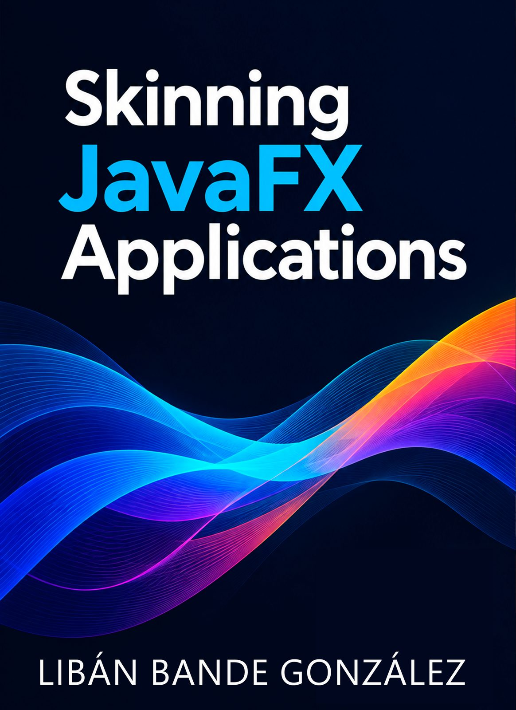

If you've ever tried to make a JavaFX application look like Microsoft or JetBrains, you know that CSS is not enough. *Skinning JavaFX Applications* is my attempt to close that gap — a practical, code-first book built from years of shipping real desktop business applications.

The main purpose of this book is to cover the Control-Skin architecture, so you can create your own custom controls and skins. We'll cover how to implement custom window chrome, runtime theme switching, Fluent Design materials like Mica and Acrylic, and a full set of micro-interactions.

You can find more details about the book at [skinning-javafx-applications.netlify.app](https://skinning-javafx-applications.netlify.app/).

