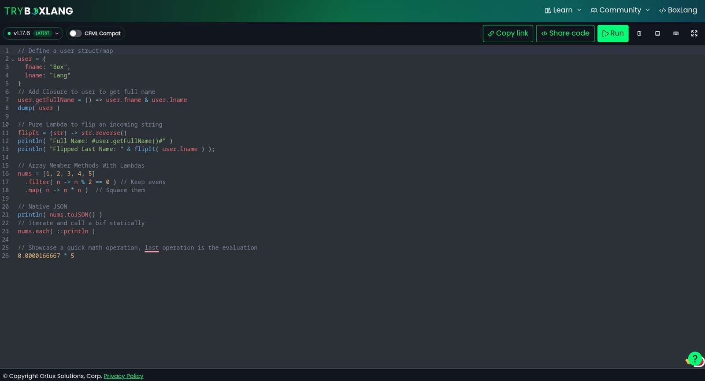
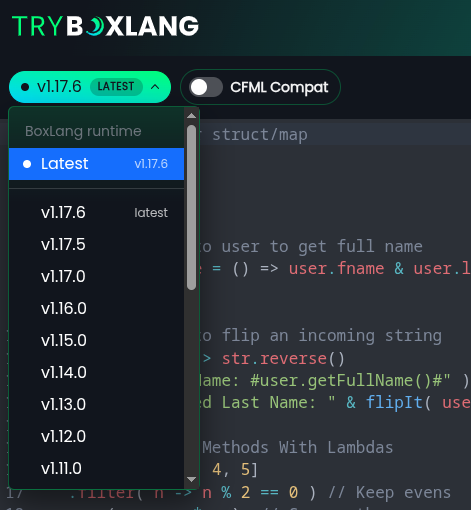
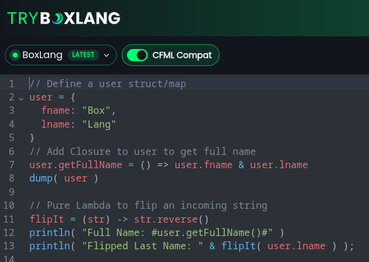

The [BoxLang playground](https://try.boxlang.io/) now lets you choose among released BoxLang versions and switch CFML compatibility on or off without installing a runtime or setting up containers. Choose a version, enter a snippet, and run it in the browser.

Behind the editor is a serverless implementation on AWS Lambda. Each combination of BoxLang version and compatibility mode is built from one repository and deployed as an isolated function. Here's what changed and how that arrangement works.



*The playground lets you select a runtime version, toggle CFML compatibility, share code, and run examples directly in the browser.*

## What's New in the Playground

### Select a BoxLang version

Use the version picker to select **Latest**, **Snapshot**, or a specific released version. Latest follows the newest release; a pinned version lets you check behavior against the same runtime on repeated runs.



*The version selector exposes the latest build, snapshots, and specific released versions so developers can compare runtime behavior.*

### Turn CFML compatibility on or off

The **CFML Compat** switch determines whether the selected environment loads `bx-compat-cfml`, BoxLang's module for running compatible Adobe ColdFusion and Lucee code. Switching it off lets you test native BoxLang separately. Every available runtime version has both configurations.



*You can run the same snippet with CFML compatibility enabled or disabled to compare native BoxLang and compatibility-mode behavior.*

## Why Version Selection Matters

- **Reproduce bugs:** run the same code against earlier and later versions to isolate behavioral changes.
- **Compare releases:** check a new feature without changing your local installation.
- **Evaluate CFML migration:** try an existing CFML snippet with compatibility enabled, then explore a native BoxLang alternative.
- **Share reproducible examples:** keep the runtime version and compatibility choice clear when reporting an issue or teaching a feature.

## Architecture: One Repository, Multiple Lambda Environments

Instead of maintaining a separate server for every version, the playground builds and deploys a matrix of isolated AWS Lambda functions.

| BoxLang runtime | CFML Compat OFF | CFML Compat ON |
|---|---|---|
| 1.17.6 | Lambda | Lambda |
| 1.17.5 | Lambda | Lambda |
| 1.17.0 | Lambda | Lambda |
| 1.16.0 | Lambda | Lambda |
| Each other supported release | Lambda | Lambda |

Each function packages its designated BoxLang version and, when needed, the compatibility module. It has its own configuration, memory, and execution context, and AWS scales it separately. Adding a release means extending the build matrix rather than creating and administering another server.

The pattern is relevant beyond playgrounds: the same repository can produce isolated runtimes for regression testing, API versions, migrations, or tenant-specific workloads.

## BoxLang Serverless on AWS Lambda

The playground uses the [BoxLang AWS Lambda runtime](https://boxlang.ortusbooks.com/getting-started/running-boxlang/aws-lambda), which developers can use in their own projects.

### Write a class, deploy a function

A Lambda application can be a BoxLang class named `Lambda.bx` with a `run()` method:

```boxlang
/**
 * My BoxLang Lambda
 */
class {

    function run( event, context, response ){
        response.statusCode = 200
        response.body = {
            "error"    : false,
            "messages" : [],
            "data"     : "Hello from BoxLang on AWS Lambda!"
        }
    }

}
```

The runtime provides the incoming JSON as a BoxLang struct in `event`. The `context` argument is the native AWS context object, accessible through Java interoperability. The optional `response` struct controls the HTTP-style response.

You can also return data directly. Strings, structs, and arrays are automatically serialized as appropriate:

```boxlang
class {

    function run( event, context, response ){
        return {
            "function"  : context.getFunctionName(),
            "remaining" : context.getRemainingTimeInMillis(),
            "when"      : now(),
            "data"      : [ 1, 2, 3 ].map( n -> n * n )
        }
    }

}
```

Configure your function with the runtime's handler:

```text
ortus.boxlang.runtime.aws.LambdaRunner::handleRequest
```

### Runtime features

The BoxLang Lambda runtime provides the conventions and services needed for more than a single-function demo:

- Request and response processing, including JSON serialization and error handling.
- Convention-based URI routing: `/products` maps to `Products.bx`, for example.
- Alternate method selection with the `x-bx-function` header.
- Reuse of compiled classes across warm invocations.
- Configurable connection pooling using `BOXLANG_LAMBDA_CONNECTION_POOL_SIZE`.
- Debug metrics with `BOXLANG_LAMBDA_DEBUGMODE=true`.
- Application lifecycle hooks through `Application.bx`.
- BoxLang modules packaged from `src/resources/boxlang_modules`.
- Logging and tracing.

### Build, test, and deploy

The [BoxLang AWS Lambda starter repository](https://github.com/ortus-boxlang/boxlang-starter-aws-lambda) includes testing, Maven dependency management, AWS SAM integration, and GitHub Actions. Its typical workflow is:

```bash
# Configure your project
cp workbench/config.env workbench/config.local.env

# Test and build your Lambda zip
./gradlew test
./gradlew build

# Run it locally
./gradlew runLocal
./gradlew runLocalApi

# Deploy to AWS
./workbench/2-deploy.sh
```

The starter includes CI/CD workflows for release and snapshot builds. Release workflows can run on pushes to `main` or through manual dispatch, while snapshot workflows handle non-main branches and pull requests. AWS deployment steps are available through the project tooling and can be enabled as needed, including deployment through `workbench/2-deploy.sh` and CloudFormation after setup.

## Why Use BoxLang for Serverless Applications?

BoxLang combines dynamic-language syntax with JVM interoperability. AWS Java libraries and Maven dependencies can be used alongside native language features, such as closures and collection member methods. Teams with existing CFML code can evaluate serverless execution using `bx-compat-cfml` rather than assuming that a complete rewrite is the only option.

Lambda's usage-based scaling also suits a versioned playground: seldom-used combinations need not run on permanently provisioned servers. Developers can take the same approach to internal testing environments or independently scaled API variants.

## Try It and Explore the Source

Open [try.boxlang.io](https://try.boxlang.io/), select a version, change the CFML Compat setting, and run a snippet. To build something similar or deploy a BoxLang function yourself, start with these resources:

- [BoxLang on AWS Lambda: documentation](https://boxlang.ortusbooks.com/getting-started/running-boxlang/aws-lambda)
- [AWS Lambda starter template](https://github.com/ortus-boxlang/boxlang-starter-aws-lambda)
- [AWS Lambda runtime source](https://github.com/ortus-boxlang/boxlang-aws-lambda)
- [BoxLang documentation](https://boxlang.ortusbooks.com/)

For the original announcement and further Ortus resources, see the [original article on the Ortus Solutions blog](https://www.ortussolutions.com/blog/tryboxlangio-now-runs-every-boxlang-version-with-or-without-cfml).
