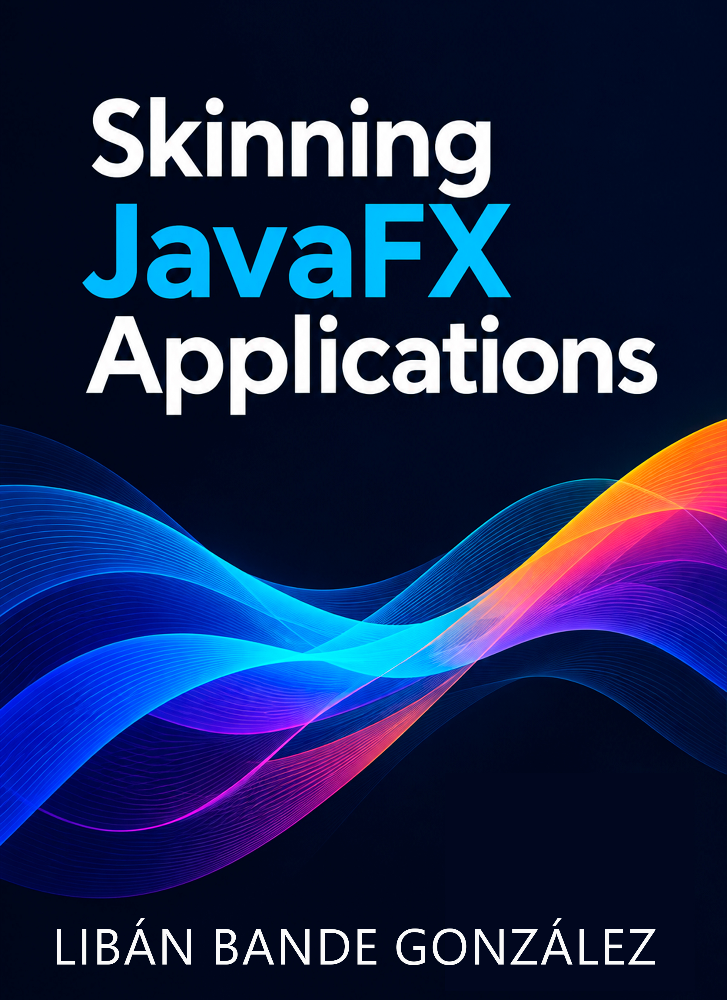

If you've ever tried to make a JavaFX application like Microsoft or Jetbrains, you know that CSS is not enough. *Skinning JavaFX Applications* is my attempt to close that gap — a practical, code-first book built from years of shipping real desktop business applications.

The main purpose of this book is to cover the architecture Control-Skin, in this way you will create your own custom controls and skins. Here we will be covering how to implement custom window chrome, runtime theme switching, Fluent Design materials like Mica and Acrylic, and a full set of micro-interactions. 

